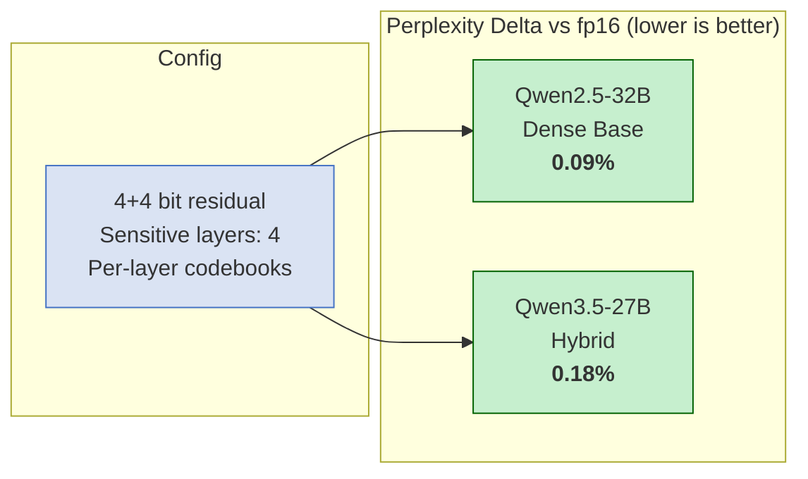
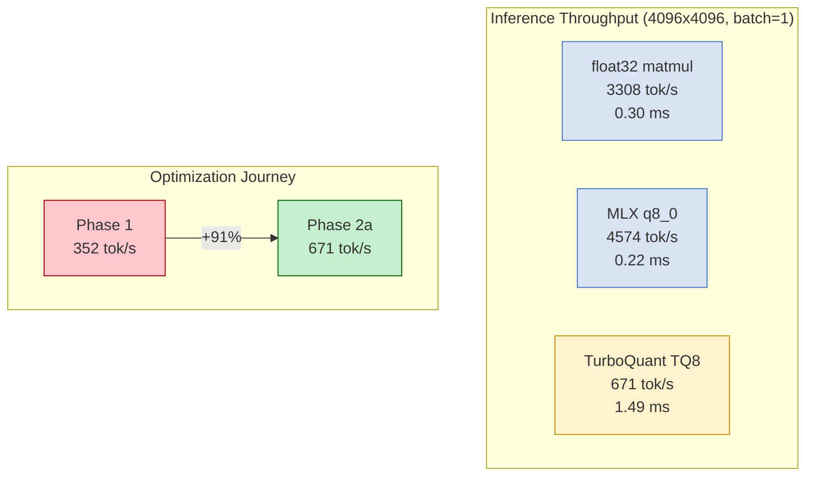
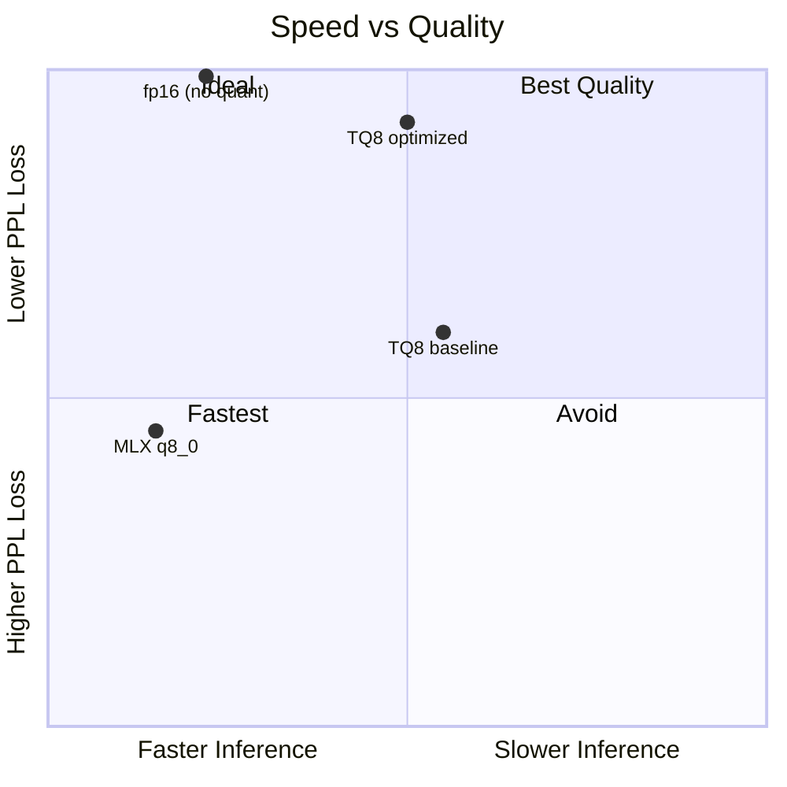
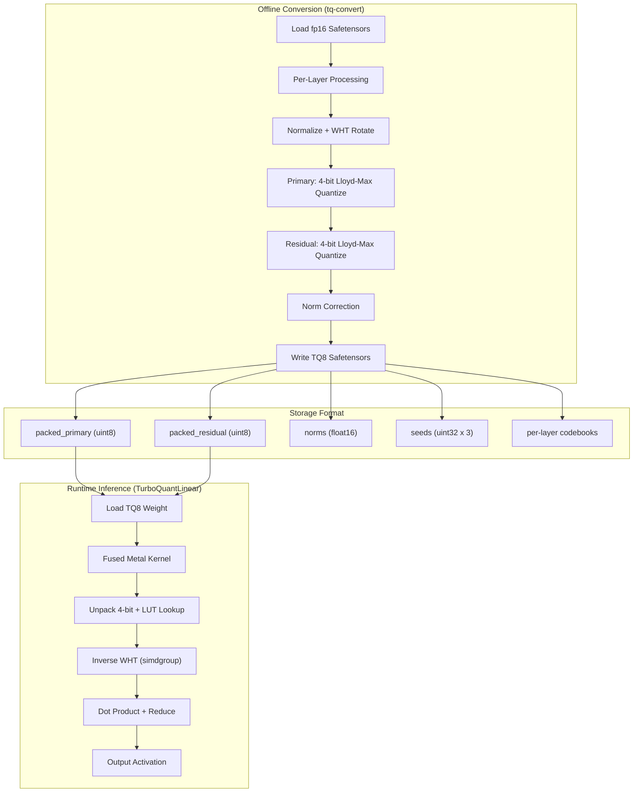

# TurboQuant-MLX Core

Core C++ library for TurboQuant near-lossless weight and KV cache compression on Apple Silicon via [MLX](https://github.com/ml-explore/mlx).

Implements the TurboQuant algorithm (Zandieh et al., ICLR 2026) as fused Metal kernels for maximum throughput on Apple GPUs.

## Quality Results

TurboQuant achieves near-lossless compression at 50% model size:



### PPL Scaling by Model Size

| Model | Architecture | fp16 PPL | TQ8 PPL | Delta | Compression |
|---|---|---|---|---|---|
| Qwen2.5-0.5B | Dense base | 1.72 | 1.80 | 4.86% | 51% |
| Qwen2.5-7B | Dense base | 1.47 | 1.53 | 3.86% | 51% |
| Qwen2.5-32B | Dense base | 1.41 | 1.42 | **0.09%** | 56% |
| Qwen3.5-27B | Hybrid | 1.45 | 1.46 | **0.18%** | 56% |

> Delta decreases with model size. Hybrid architectures (linear attention + Mamba) quantize 6x better than dense at the same scale.

### What to Expect

| Scenario | Expected PPL Delta | Notes |
|---|---|---|
| Dense base models >= 27B | < 0.2% | With `--sensitive-layers 4 --per-layer-codebooks` |
| Hybrid models (Qwen3.5) | < 0.2% | Linear attention layers are naturally compressible |
| Coder/instruct models | < 0.1% | More structured weight distributions |
| Dense base models < 7B | 2-5% | Less redundancy, each weight matters more |
| Any model, baseline config | 1-2% | Without per-layer codebooks or sensitive layers |

## Speed Results



| Implementation | Time/token | Throughput | vs float32 |
|---|---|---|---|
| float32 matmul (reference) | 0.30 ms | 3308 tok/s | 1.0x |
| MLX q8_0 affine (reference) | 0.22 ms | 4574 tok/s | 0.72x (faster) |
| **TurboQuant TQ8** | **1.49 ms** | **671 tok/s** | **4.93x** |
| TQ8 pre-optimization | 2.84 ms | 352 tok/s | 6.77x |

| Real Model Layer (151936x2048) | Time/token | Throughput |
|---|---|---|
| Pre-optimization | 39.8 ms | 25.1 tok/s |
| **Post-optimization** | **21.1 ms** | **47.3 tok/s** |

> TQ8 trades inference speed for compression quality. MLX q8_0 is faster but has higher PPL degradation (~0.5-1% vs TQ8's 0.09-0.18%). Choose based on your quality requirements.

### Speed vs Quality Tradeoff



## Features

- **Weight compression**: 4+4 residual quantization (8-bit effective) with < 0.2% PPL loss on 27B+ models
- **KV cache compression**: 3.5-bit online compression with QJL correction for unbiased attention scoring
- **Fused Metal kernels**: Single-dispatch dequant + matmul with simdgroup WHT and 256-entry LUT
- **Per-layer codebooks**: Lloyd-Max fitted to each layer's actual distribution (89% MSE reduction)
- **Sensitive layers**: First/last N layers kept at fp16 for boundary layer protection
- **Distributed inference**: Multi-Mac clusters via JACCL/RDMA and Ring/TCP
- **Dual build**: CMake for development, Swift Package Manager for SwiftLM integration

## Quick Start

### Build

```bash
brew install cmake mlx
git clone https://github.com/ekovshilovsky/turboquant-mlx-core
cd turboquant-mlx-core
cmake -B build -DCMAKE_BUILD_TYPE=Release
cmake --build build
ctest --test-dir build --output-on-failure
```

### Convert a Model (Optimal Config)

```bash
./build/tq-convert --model /path/to/Qwen3.5-27B \
  --sensitive-layers 4 \
  --per-layer-codebooks \
  --bits 4 --residual-bits 4 \
  --output /path/to/Qwen3.5-27B-TQ8
```

| Flag | Effect | Quality Impact | Speed Impact |
|---|---|---|---|
| `--sensitive-layers 4` | Keep first/last 4 layers at fp16 | -30% delta | None (fewer layers to dequant) |
| `--per-layer-codebooks` | Fit codebooks to each layer | -90% MSE | None (same lookup) |
| `--bits 4 --residual-bits 4` | 4+4 symmetric (default) | Optimal for 8-bit budget | — |
| `--shared-rotation` | Single WHT pass (opt-in) | +0.1% delta | +40% faster inference |

### Validate Quality

```bash
# Dequant to fp16 for PPL comparison
./build/tq-dequant /path/to/TQ8-model /path/to/dequanted

# Evaluate with mlx-lm
python scripts/eval_ppl.py --tq-model /path/to/TQ8-model --original /path/to/fp16-model
```

### Python Bindings

```python
import turboquant_mlx as tq

tq.version()                    # "0.1.0"
cb = tq.generate_codebook(4)    # Lloyd-Max 4-bit codebook
tq.convert_model(input_path="/path/to/model", output_path="/path/to/output")
tq.validate_model("/path/to/output")
```

## Architecture



## Repository Structure

```
turboquant-mlx-core/
├── include/turboquant/     # Public C++ API headers
├── include/turboquant_c/   # C API for Swift bridge
├── src/                    # C++ implementations
├── metal/                  # Metal shader programs (compiled to .metallib)
├── tools/                  # CLI tools (tq-convert, tq-dequant)
├── tests/                  # Unit, integration, C API, and GPU stream tests
├── benchmarks/             # Performance measurement suite
├── bindings/               # Python (nanobind), Node.js (N-API), Rust (planned)
└── docs/                   # Development journal and specs
```

## License

MIT License - Copyright (c) 2026 Eugene Kovshilovsky
